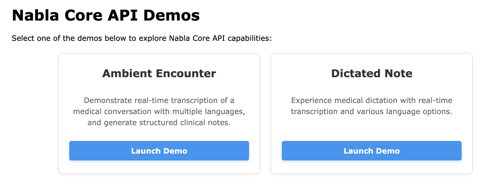

# Nabla Core API Sample App



A minimal web app (in `app/`) that shows how to interact with the [Nabla Core API](https://docs.nabla.com).

---

## ✨ Quick Start

### 1. Create an OAuth client 🔑
- Sign in to the Core API admin console: [Sign up](https://pro.nabla.com/core-api-signup) or [Log in](https://pro.nabla.com/login).
- Create an OAuth Client in OAuth Clients section.

### 2. Generate initial tokens 🌱
You need to use this OAuth client to generate initial user access and refresh tokens for the app. In a realistic architecture, this work would be done by a dedicated authentication backend server on your side. For simplicity's sake, however, we provide an helper node script that imitates a backend server that would create and authenticate a Core API user.

Fill in these variables inside `scripts/initialTokensGenerator.js`:

- `OAUTH_CLIENT_UUID` – UUID of your OAuth client (copy it from the admin console).
- `OAUTH_CLIENT_PRIVATE_KEY` – private key matching the public key you registered.
- `REGION` – `us` or `eu`, matching your organization’s region.

Then execute the script with the command:

```bash
# Run with Node ⩾ 18
node scripts/initialTokensGenerator.js
```

*Result:* the script writes a `userTokens.json` file containing your new tokens.

> ℹ️ **Need a server token instead?**  
> Append `--type=server` to the command above to generate a long-lived **server access token** rather than user access/refresh tokens. Use this when calling the Server API directly from your own tools.

### 3. Configure the frontend ⚙️
Open `app/shared/authentication.js` and paste the credentials generated in **Step&nbsp;2** (or any other source you use):

```js
const INITIAL_USER_ACCESS_TOKEN  = '...';
const INITIAL_USER_REFRESH_TOKEN = '...';
const REGION                     = 'us'; // or 'eu'
```

### 4. Launch the app 🚀
Any static HTTP server works; with Node.js you can simply run:

```bash
npx http-server app/
# Then visit http://127.0.0.1:8080/
```

> ℹ️ **API version notice:**  
> Please note that this sample app is only compatible with a specific version of the API, specified at the beginning of [commonUtils.js](app/shared/commonUtils.js) file.

---

## 📚 Further reading

- **Authentication guide:** <https://docs.nabla.com/guides/authentication>
- **Full API docs:** <https://docs.nabla.com>

