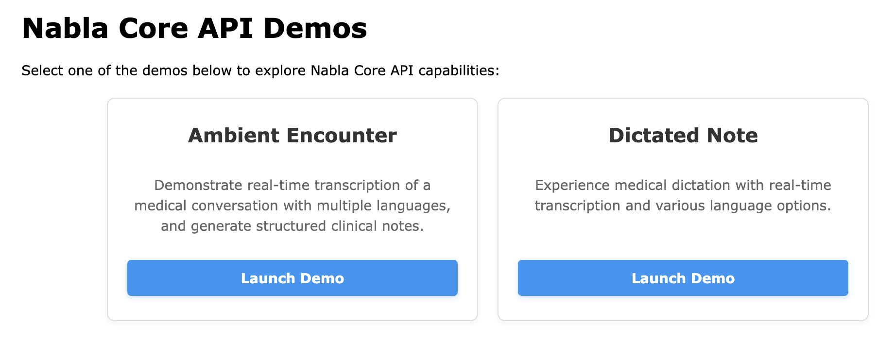

# Nabla Core API Sample App



A minimal web app (in `app/`) that shows how to interact with the [Nabla Core API](https://docs.nabla.com).

---

## ✨ Quick Start

### 0. Prerequisites 📋

- Node.js v22+
- A Nabla Core API account ([contact us](mailto:api@nabla.com) to create one)

### 1. Download and setup the project 📦

```bash
git clone git@github.com:nabla/sample-app.git
cd sample-app/
npm install
```

### 2. Create an OAuth client 🔑

- Sign in to the Core API admin console: [Log in](https://pro.nabla.com/login).
- Follow the [documentation](https://docs.nabla.com/guides/authentication#1-creating-an-oauth-client) to create a new OAuth Client with the "Public Key (static)" method.

### 3. Generate user tokens 🌱

You need to use this OAuth client to generate initial user access and refresh tokens for the app. In a realistic architecture, this work would be done by a dedicated authentication backend server on your side. For simplicity's sake, however, we provide an helper node script that imitates a backend server that would create and authenticate a Core API user.

This script is located under `scripts/generate-tokens.js` and expects the following CLI required arguments:
* `--uuid` (type:`string`): the OAuth client UUID for authentication
* `--private-key` (type:`string`): the path to the private key file (generally `private_key.pem` if you followed the documentation closely at the previous step)
* `--hostname` (type:`string`): Nabla's API hostname: `us.api.nabla.com` for US region or `eu.api.nabla.com` for EU region.

Run the following command to generate a pair of user access/refresh tokens:

```bash
node scripts/generate-tokens.js \
  --uuid=<oauth-uuid> \
  --private-key=<private-key-file> \
  --hostname=eu.api.nabla.com
```

> ℹ️ **Need a server token instead?**
> Pass the `--type=server` argument to the command above to generate a long-lived **server access token** rather than user access/refresh tokens. Use this when calling the Server API directly from your own tools.

### 4. Configure the frontend ⚙️

To launch the app the following environment variables needs to be set:
- `VITE_NABLA_ACCESS_TOKEN`: a user access token
- `VITE_NABLA_REFRESH_TOKEN`: a user refresh token
- `VITE_NABLA_API_HOSTNAME`: Nabla's API hostname: `us.api.nabla.com` for US region or `eu.api.nabla.com` for EU region.

Create `.env.local` file at the root of the project and add the credentials generated in **Step&nbsp;3** (or any other source you use):

```env
VITE_NABLA_ACCESS_TOKEN=my_user_access_token
VITE_NABLA_REFRESH_TOKEN=my_user_refresh_token
VITE_NABLA_API_HOSTNAME=eu.api.nabla.com
```

### 5. Launch the app 🚀

Run the following command and navigate to http://localhost:5173/

```bash
npm run dev
```

> ℹ️ **API version notice:**
> Please note that this sample app is only compatible with a specific version of the API, specified at the beginning of [commonUtils.js](app/shared/commonUtils.js) file.

---

## 📚 Further reading

- **Authentication guide:** <https://docs.nabla.com/guides/authentication>
- **Full API docs:** <https://docs.nabla.com>
